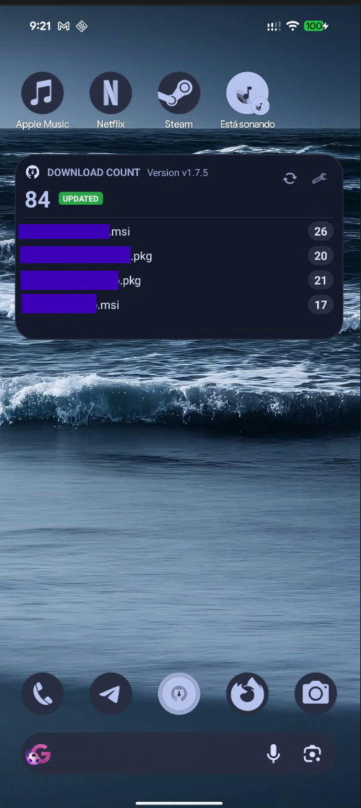
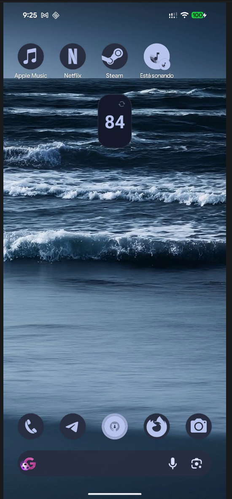
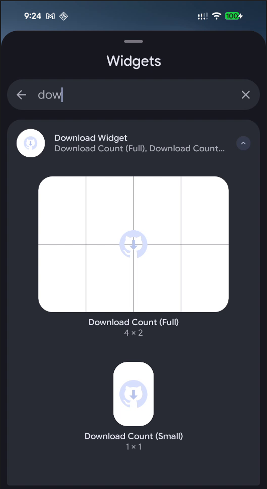

# Download Widget Android

Android home-screen widget that shows download counts for assets from a specific GitHub release.

## Demo

Normal Layout Image:



Small Layout Image:



Layout Options:



Video:

[Watch demo video](https://github.com/<your_repo>/releases)

## What it does

- Adds a resizable home-screen widget titled **Download Count**.
- Calls the GitHub Releases API and finds a configured release tag (for example `v1.7.5`).
- Sums `download_count` across all assets in that release.
- Displays:
  - total download count,
  - per-asset download counts in a list,
  - update status (`UPDATED`, `IN PROGRESS`, `NOT UPDATED`).
- Supports manual refresh from the widget.
- Includes a settings screen to configure API URL and release version per widget.

## How it works

1. `DownloadWidgetProvider` handles widget updates and refresh button actions.
2. It fetches release data over HTTP using OkHttp.
3. Asset data is cached in SharedPreferences (`download_widget_prefs`).
4. Configuration and cached assets are stored per `appWidgetId`.
5. `AssetListRemoteViewsService` reads cached JSON and provides list rows for the widget.
6. `MainActivity` hosts `SettingsFragment`, where API URL and version are edited for the selected widget.

## Configuration

Open the app from each widget's settings button and set values for that widget:

- **API URL**
  - Default: `https://api.github.com/repos/<your_repo>/releases`
- **Release Version**
  - Default: `<your_version>`

Each widget instance uses its own API URL/version pair and queries the release whose `tag_name` matches that widget's configured version.

## Requirements

- Android `minSdk 26`
- `targetSdk 34`
- Java 17
- Internet access (uses `android.permission.INTERNET`)

## Build and run

From project root:

```bash
./gradlew assembleDebug
```

On Windows PowerShell:

```powershell
.\gradlew.bat assembleDebug
```

Then install/run from Android Studio or with ADB as usual.

## Notes

- `updatePeriodMillis` is `0`, so the system does not perform periodic auto-refreshes, due to API limits.
- Data refresh is manual from the widget refresh action (or when the widget is updated by the host).
- GitHub API rate limits may apply if requests are frequent or unauthenticated.
