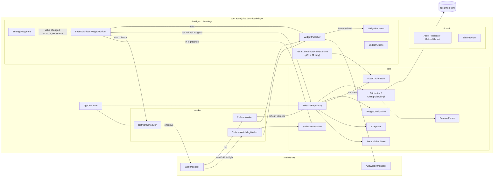

# Architecture

## Rationale

Single Gradle module, layered Kotlin packages, manual dependency injection. Deliberately
smaller than "standard" Android reference architectures: for a ~1000-line codebase with a
five-node dependency graph, Hilt / multi-module / Room would all be ceremony without
customer value.

## Pipeline

## Contracts (unchanged public surface)

- `GitHubApi.fetchRelease(url, tag, token, etag): ApiResponse` — never throws; all failure
  modes are variants of the sealed `ApiResponse`.
- `ReleaseRepository.refresh(widgetId): RefreshResult` — never throws; consumes an
  `ApiResponse`, mutates the local stores when appropriate, returns a domain-level
  `RefreshResult`. Callers pattern-match this to build a `WidgetState`.
- `WidgetRenderer.render(context, layoutId, widgetId, state, providerClass): RemoteViews` —
  pure(-ish) function; the same `WidgetState` always produces the same widget UI.
- `RefreshScheduler.ensurePeriodic()` — idempotent (`ExistingPeriodicWorkPolicy.KEEP`).
  Called once from `DownloadWidgetApp.onCreate`.

## Threading

- All HTTP goes through `OkHttpGitHubApi.fetchRelease`, which bridges OkHttp's `enqueue`
  through `suspendCancellableCoroutine` and aborts the `Call` from `invokeOnCancellation`.
  This is deliberate, not stylistic: `Call.execute()` blocks and never polls `isActive`, so
  with the old blocking bridge a caller's `withTimeout` fired on schedule but could not
  return until OkHttp's *own* timeouts released the thread — measured at 15 s for an 8 s
  budget. Cancelling the call is what makes a caller's timeout real.
- `ReleaseRepository.refresh()` is a `suspend fun` with two callers: `RefreshWorker`
  (periodic and one-shot) and the tap-refresh coroutine in `BaseDownloadWidgetProvider`.
  Both run off the main thread.
- `SharedPreferences.edit { … }` is synchronous. WorkManager guarantees sequential
  execution per unique work name, so per-widget preference writes don't race with each
  other.
- Every `RemoteViews` push goes through `WidgetPublisher.publish`, on the main thread.
  Some `AppWidgetHost` implementations drop updates issued from a background thread while
  an earlier update is still pending.

### Why the asset list is inlined, and the bug that forced it

For three releases the widget had the same complaint against it: tap refresh, and the
spinner keeps turning on a yellow "UPDATING" badge that never resolves. Two rounds of
fixes attacked it as a redraw problem — first `partiallyUpdateAppWidget`, then splitting
the two renders across separate receiver invocations spaced past a supposed launcher
"dedup window". Neither held, because neither was the cause.

The cause was the asset list. It used to be backed by `AssetListRemoteViewsService`
through the legacy `setRemoteAdapter(viewId, Intent)`, re-wired on **every** render. A
`RemoteViews` carrying a remote adapter makes the host bind that service and apply the
tree asynchronously, and on the target launchers that apply never replaced the live view.
The host kept the previous view tree — whose adapter was still alive and still answered
`notifyAppWidgetViewDataChanged`.

That is what made it so hard to read: **the asset list kept updating while the count, the
badge and the spinner stayed frozen on whatever rendered first.** A widget showing fresh
per-asset numbers next to a stale total looks like a repaint bug, so that is what three
rounds of fixes went after. It was an apply failure.

From API 31 the rows travel inside the `RemoteViews` itself via
`RemoteViews.RemoteCollectionItems`: no service, no binding, no async apply, and no
`notifyAppWidgetViewDataChanged`. The whole widget lands as one unit. Below API 31 the
service-backed adapter is still the only option, so that path is kept and is the only
place the notify call survives.

The rows are now derived from the same `WidgetState` as everything else
(`WidgetRenderer.assetsFor`), so the list and the total cannot disagree again — the
specific way this bug camouflaged itself is now structurally impossible.

### Tap-refresh path

`Loading` is the only non-terminal `WidgetState`, and it is cleared by a *later* render.
The invariant that keeps it honest:

> **A `Loading` render is never issued without a scheduled way out of it.**

1. `BaseDownloadWidgetProvider.onReceive` handles `ACTION_REFRESH` on the receiver's main
   thread. Before drawing anything it persists an "in flight since" stamp
   (`RefreshStateStore`) and arms `RefreshWatchdogWorker` for `WATCHDOG_DELAY` (15 s).
   Only then does it publish `Loading` — spinner up, badge yellow.
2. `goAsync()` keeps the process alive while a coroutine fetches off the main thread,
   bounded by a real `REFRESH_TIMEOUT` (8 s).
3. The spinner is held for at least `MIN_SPINNER_DWELL` (2 s) from the `Loading` render,
   so the user sees that something happened.
4. The terminal state — derived from the **actual** `RefreshResult`, not from a re-read of
   the cache — is published on the main thread. Only once it is out does the coroutine
   clear the stamp and disarm the watchdog.

If the process dies anywhere in steps 2–4, WorkManager outlives it and the watchdog fires,
finds its stamp still in place and publishes a terminal error render. The stamp doubles as
a fencing token: a watchdog that fires late stands down unless the exact stamp it was armed
for is still the live one, so it can never clobber a newer, healthy refresh.

`SettingsFragment.triggerRefresh` fires `ACTION_REFRESH` for every affected widget, so a
config change takes this same path.

`onUpdate` does **not** hit the network. It paints from cache and hands the fetch to
`RefreshScheduler.enqueueOneShot`; it runs on the receiver's main thread, where a blocking
HTTP call was an ANR waiting for a slow network.

The periodic 60-min refresh continues to use `RefreshWorker`, which publishes a terminal
state for every widget it touches.

## Security posture

- **PAT** stored in `EncryptedSharedPreferences` (AES-256-GCM values, AES-256-SIV keys),
  master key in Android Keystore.
- **`allowBackup=false`** + explicit `data_extraction_rules.xml` + `backup_rules.xml` so
  Google Backup and device-to-device transfers cannot exfiltrate prefs.
- **`usesCleartextTraffic=false`** + `network_security_config.xml` with system trust
  anchors only.
- **`SafeLogger`** redacts `Bearer` / `Authorization` / `token=` / `PAT` substrings before
  any `Log.*` call.
- **Legacy migration**: pre-1.0 plaintext `pref_github_token[_widgetId]` keys are purged
  from the plain prefs on first launch of 1.0.0 (`LegacyTokenCleanup.purge`). No plaintext
  → encrypted migration path is intentionally provided; users re-enter their PAT.

## What is deliberately out of scope

- **Jetpack Glance** — classic `AppWidgetProvider` remains a widely-taught pattern and
  reviewers can read it top-to-bottom in one sitting.
- **Compose for Settings** — the classic `PreferenceFragmentCompat` is a better fit for a
  single-screen widget configurator.
- **Room** — three prefs files hold the whole app state. Room would multiply build config
  and give nothing back.
- **Hilt / Koin** — the `AppContainer` fits on one screen. Adding a DI framework here is a
  cost with no benefit.
- **Multi-repo widgets** — one widget = one tag by design. If you need three counts, drop
  three widgets on the home screen.
