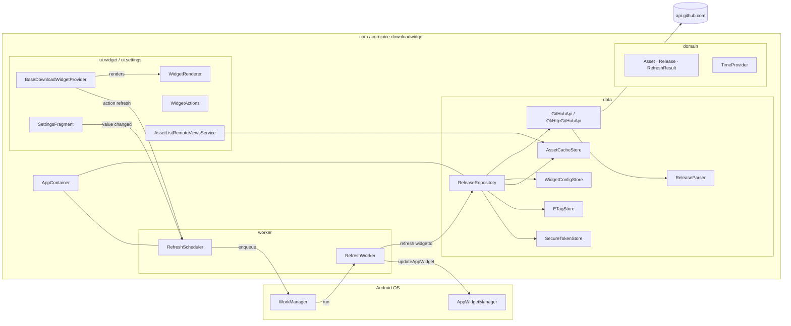

# Architecture

## Rationale

Single Gradle module, layered Kotlin packages, manual dependency injection. Deliberately
smaller than "standard" Android reference architectures: for a ~1000-line codebase with a
five-node dependency graph, Hilt / multi-module / Room would all be ceremony without
customer value.

## Pipeline

## Contracts (unchanged public surface)

- `GitHubApi.fetchRelease(url, tag, token, etag): ApiResponse` — never throws; all failure
  modes are variants of the sealed `ApiResponse`.
- `ReleaseRepository.refresh(widgetId): RefreshResult` — never throws; consumes an
  `ApiResponse`, mutates the local stores when appropriate, returns a domain-level
  `RefreshResult`. Callers pattern-match this to build a `WidgetState`.
- `WidgetRenderer.render(context, layoutId, widgetId, state, providerClass): RemoteViews` —
  pure(-ish) function; the same `WidgetState` always produces the same widget UI.
- `RefreshScheduler.ensurePeriodic()` — idempotent (`ExistingPeriodicWorkPolicy.KEEP`).
  Called once from `DownloadWidgetApp.onCreate`.

## Threading

- All HTTP goes through `OkHttpGitHubApi.fetchRelease`, which wraps `Call.execute()` in
  `withContext(Dispatchers.IO)`.
- `ReleaseRepository.refresh()` is a `suspend fun`. Its only caller is `RefreshWorker`,
  which runs on `Dispatchers.Default`.
- `SharedPreferences.edit { … }` is synchronous. WorkManager guarantees sequential
  execution per unique work name, so per-widget preference writes don't race with each
  other.
- `RemoteViews` updates from the periodic worker go through `AppWidgetManager.updateAppWidget`
  on the WorkManager dispatcher, which is safe by contract.

### Tap-refresh path (1.0.1+)

The refresh button on the widget does **not** route through `RefreshWorker`. Empirically,
`updateAppWidget` calls issued from a WorkManager worker context are silently coalesced
or dropped by some launcher implementations (observed on stock Pixel launchers on
Android 15+). The tap path instead runs entirely from receiver contexts:

1. `BaseDownloadWidgetProvider.onReceive` handles `ACTION_REFRESH` synchronously on the
   receiver's main thread and emits `updateAppWidget(Loading)` immediately, so the
   spinner + yellow "UPDATING" badge appear right away.
2. `goAsync()` keeps the process alive; a coroutine on `Dispatchers.IO` runs
   `ReleaseRepository.refresh(widgetId)` off the main thread.
3. After the HTTP call plus a defensive `POST_LOADING_DELAY` to age past the launcher's
   dedup window, the coroutine broadcasts a custom `ACTION_APPLY_FOLLOWUP` intent.
4. `onReceive` handles the follow-up in a **fresh** receiver invocation and emits the
   terminal state via `partiallyUpdateAppWidget` — a different launcher code path that
   is not subject to the same coalescing. Widget flips to green "UPDATED".

`SettingsFragment.triggerRefresh` fires `ACTION_REFRESH` for every affected widget so
config-change refreshes take the same reliable path.

The periodic 60-min refresh continues to use `RefreshWorker` — its cache write still
lands even if the widget repaint is dropped, and the next `onUpdate` (or the next
user tap) paints the fresh data.

## Security posture

- **PAT** stored in `EncryptedSharedPreferences` (AES-256-GCM values, AES-256-SIV keys),
  master key in Android Keystore.
- **`allowBackup=false`** + explicit `data_extraction_rules.xml` + `backup_rules.xml` so
  Google Backup and device-to-device transfers cannot exfiltrate prefs.
- **`usesCleartextTraffic=false`** + `network_security_config.xml` with system trust
  anchors only.
- **`SafeLogger`** redacts `Bearer` / `Authorization` / `token=` / `PAT` substrings before
  any `Log.*` call.
- **Legacy migration**: pre-1.0 plaintext `pref_github_token[_widgetId]` keys are purged
  from the plain prefs on first launch of 1.0.0 (`LegacyTokenCleanup.purge`). No plaintext
  → encrypted migration path is intentionally provided; users re-enter their PAT.

## What is deliberately out of scope

- **Jetpack Glance** — classic `AppWidgetProvider` remains a widely-taught pattern and
  reviewers can read it top-to-bottom in one sitting.
- **Compose for Settings** — the classic `PreferenceFragmentCompat` is a better fit for a
  single-screen widget configurator.
- **Room** — three prefs files hold the whole app state. Room would multiply build config
  and give nothing back.
- **Hilt / Koin** — the `AppContainer` fits on one screen. Adding a DI framework here is a
  cost with no benefit.
- **Multi-repo widgets** — one widget = one tag by design. If you need three counts, drop
  three widgets on the home screen.
